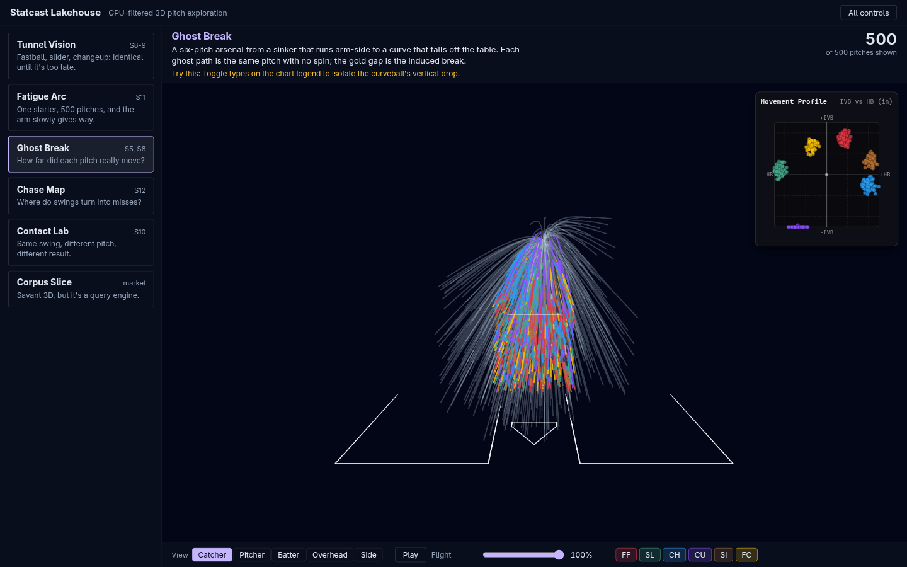
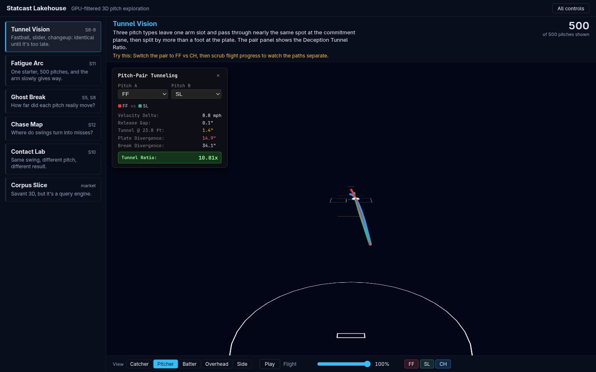
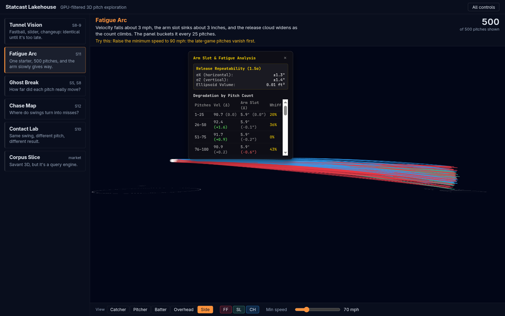
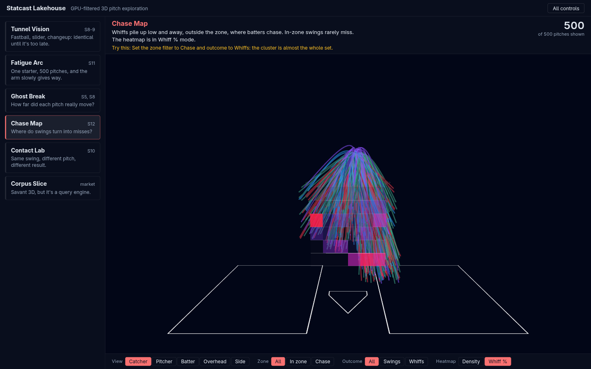
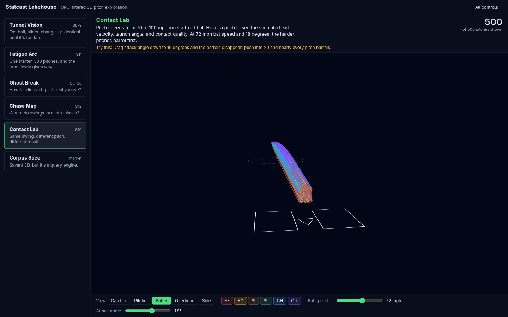
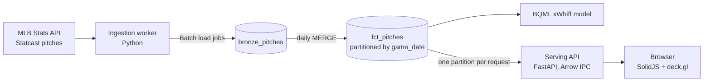
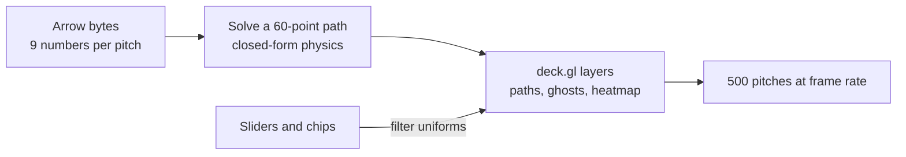
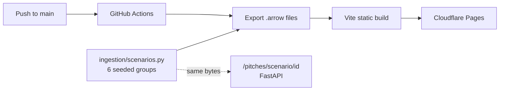

# Statcast Lakehouse

See MLB pitches as 3D trajectories, 500 at a time, and filter them on the GPU.

**[Live demo: statcast-lakehouse.pages.dev](https://statcast-lakehouse.pages.dev)**



## What it is

Statcast gives every pitch nine numbers: where it started, how fast it moved, and how it curved.
This project turns those nine numbers into a full 3D path in your browser.
Sliders and filters run on the GPU, so scrubbing stays smooth.

Behind the demo is a small data pipeline: ingest into BigQuery, train an xWhiff model in the warehouse, and serve Apache Arrow over HTTP.

## The demo: six stories

Each story is a group of 500 pitches built to show one idea. Pick one, read the caption, and try the suggestion.

| | |
|---|---|
| <br>**Tunnel Vision.** Three pitches look identical until it is too late, then split by more than a foot. | <br>**Fatigue Arc.** One starter loses 3 mph and the arm slot sinks over 500 pitches. |
| <br>**Chase Map.** Swings turn into misses low and away, outside the zone. | <br>**Contact Lab.** Same swing, different pitch, different contact. Hover a pitch to see it. |

The other two: **Ghost Break** (how far did each pitch really move?) and **Corpus Slice** (ten pitchers, every filter live).

## How it works

### The big picture



### In the browser

The server sends nine numbers per pitch, not a full path. The browser works out the path once, then the GPU does the rest.



### How the demo is hosted

The six stories are generated with fixed seeds, so they never change. They are exported as static files and served by Cloudflare Pages. No server runs.



## Run it

```sh
# Tests: no cloud account needed
pip install -r ingestion/requirements.txt -r serving/requirements.txt pytest
python3 -m pytest -q
cd web && npm ci && npm test

# The demo with the API (two terminals)
uvicorn serving.app:app --port 8000
cd web && npm run dev                    # http://localhost:5173

# The static build that Cloudflare serves
cd web && npm run build:static           # needs python3 + pyarrow
cd web && npm run deploy                 # needs `npx wrangler login`

# A synthetic day of pitches as an Arrow file
python3 -m ingestion.worker --dry-run --pitches 300 --out data/sample.arrow
```

Loading real data (`--live`, BigQuery, BQML) needs Google Cloud credentials.

## Status

The demo needs no cloud account and costs nothing to host. The warehouse, ingestion and model code is finished and tested offline; putting it on a real GCP project is the remaining work (see [ROADMAP](docs/ROADMAP.md), items 1 and 2). The design aims for under $5 a month of GCP spend.

## Rules the code keeps

- **Arrow only.** The server never sends JSON for pitch data.
- **GPU filtering.** Sliders change GPU settings. No loop runs over the pitches while you drag.
- **One day per query.** Every warehouse query filters on `game_date`, which keeps scans inside the free tier.
- **Same physics twice.** The Python and TypeScript solvers must give the same numbers, and tests pin both.
- **Free tier.** No paid GCP services, and a budget guard sits in front of the project.

## Layout

| Path | What is there |
|---|---|
| `ingestion/` | MLB client, kinematics solver, demo scenarios, BigQuery writer |
| `warehouse/` | BigQuery DDL and BQML SQL |
| `serving/` | FastAPI Arrow endpoints |
| `web/` | SolidJS app, deck.gl layers, tests, Cloudflare config |
| `infra/` | Terraform: dataset, budget guard, Cloud Run, scheduler |
| `docs/` | Architecture, roadmap, research, screenshots |

## Docs

- [`TDD.md`](TDD.md): the technical design, and the source of truth
- [`docs/ARCHITECTURE.md`](docs/ARCHITECTURE.md): data flow and key decisions
- [`docs/ROADMAP.md`](docs/ROADMAP.md): what is done and what is next
- [`AGENTS.md`](AGENTS.md): operating manual for coding agents
