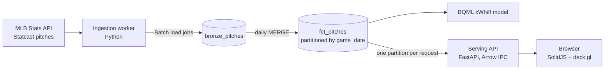
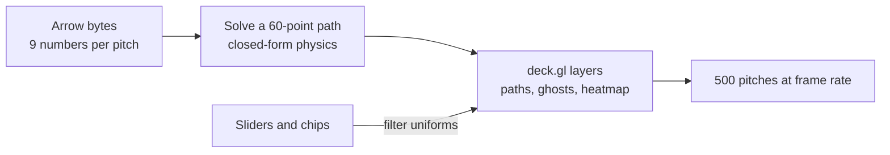
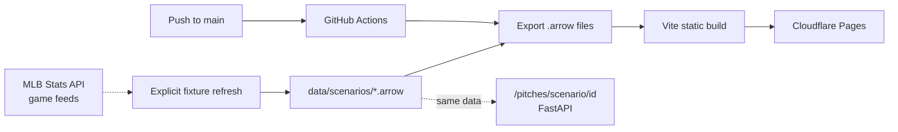

# Statcast Lakehouse

Explore real MLB pitches as 3D trajectories and filter them on the GPU.

**[Live demo: statcast-lakehouse.pages.dev](https://statcast-lakehouse.pages.dev)**

## What it is

Statcast gives every pitch nine numbers: where it started, how fast it moved, and how it curved.
This project turns those nine numbers into a full 3D path in your browser.
Sliders and filters run on the GPU, so scrubbing stays smooth.

Behind the demo is a small data pipeline: ingest into BigQuery, train an xWhiff model in the warehouse, and serve Apache Arrow over HTTP.

## The demo: five real-game stories

Each card links to the MLB story and the MLB Stats API feed used for its pitch paths.

- [Ohtani's 50/50 night](https://www.mlb.com/stories/shohei-ohtani-historic-50-50-day): all 370 pitches from the Dodgers' 20–4 win over Miami.
- **Six Trips to the Plate:** the 22 pitches Ohtani saw during his 6-for-6, three-homer, 10-RBI game.
- **The 50th Home Run:** four measured pitches from the top-of-the-seventh at-bat that completed the 50/50 milestone.
- [Freeman's walk-off grand slam](https://www.mlb.com/news/freddie-freeman-walk-off-grand-slam-world-series-game-1-2024): the 13 pitches from his plate appearances in World Series Game 1.
- [Snell's no-hitter](https://www.mlb.com/news/blake-snell-throws-no-hitter-for-giants-vs-reds): all 114 pitches from his 11-strikeout complete game.

The pitch slices are included as Arrow files, with exact game ids and selection rules in [`data/scenarios/README.md`](data/scenarios/README.md). The app opens the real source game feed from each story caption.

## How it works

### The big picture



### In the browser

The server sends nine numbers per pitch, not a full path. The browser works out the path once, then the GPU does the rest.



### How the demo is hosted

The curated game slices are exported as static files and served by Cloudflare Pages. Refreshing the fixtures requires an explicit request to MLB Stats API; normal builds are offline.



## Run it

```sh
# Tests: no cloud account needed
pip install -r ingestion/requirements.txt -r serving/requirements.txt pytest
python3 -m pytest -q
cd web && npm ci && npm test

# The demo with the API (two terminals)
uvicorn serving.app:app --port 8000
cd web && npm run dev                    # http://localhost:5173

# The static build that Cloudflare serves
cd web && npm run build:static           # needs python3 + pyarrow
cd web && npm run deploy                 # needs `npx wrangler login`

# A synthetic day of pitches as an Arrow file
python3 -m ingestion.worker --dry-run --pitches 300 --out data/sample.arrow

# Refresh the curated real-game slices (explicit MLB Stats API request)
python3 -m ingestion.scenario_data --refresh
```

Loading real data (`--live`, BigQuery, BQML) needs Google Cloud credentials.

## Status

The demo needs no cloud account and costs nothing to host. The warehouse, ingestion and model code is finished and tested offline; putting it on a real GCP project is the remaining work (see [ROADMAP](docs/ROADMAP.md), items 1 and 2). The design aims for under $5 a month of GCP spend.

## Rules the code keeps

- **Arrow only.** The server never sends JSON for pitch data.
- **GPU filtering.** Sliders change GPU settings. No loop runs over the pitches while you drag.
- **One day per query.** Every warehouse query filters on `game_date`, which keeps scans inside the free tier.
- **Same physics twice.** The Python and TypeScript solvers must give the same numbers, and tests pin both.
- **Free tier.** No paid GCP services, and a budget guard sits in front of the project.

## Layout

| Path | What is there |
|---|---|
| `ingestion/` | MLB client, kinematics solver, demo scenarios, BigQuery writer |
| `warehouse/` | BigQuery DDL and BQML SQL |
| `serving/` | FastAPI Arrow endpoints |
| `web/` | SolidJS app, deck.gl layers, tests, Cloudflare config |
| `infra/` | Terraform: dataset, budget guard, Cloud Run, scheduler |
| `docs/` | Architecture, roadmap, research, screenshots |

## Docs

- [`TDD.md`](TDD.md): the technical design, and the source of truth
- [`docs/ARCHITECTURE.md`](docs/ARCHITECTURE.md): data flow and key decisions
- [`docs/ROADMAP.md`](docs/ROADMAP.md): what is done and what is next
- [`AGENTS.md`](AGENTS.md): operating manual for coding agents
